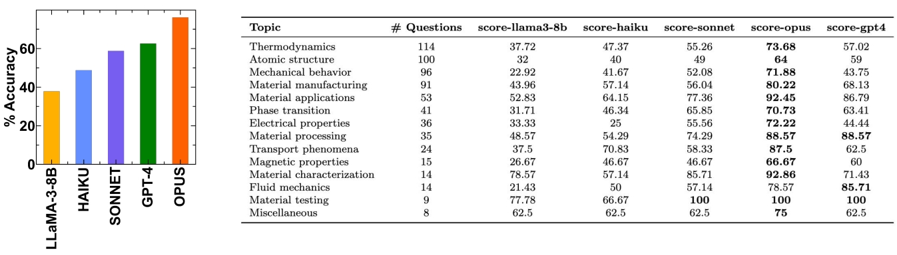

# Materials Science Question Answering

## Dataset

This repository contains a dataset of materials science questions spanning various categories such as characterization, applications, properties, and behavior. The dataset includes numerical and multiple-choice questions to evaluate the performance of large language models on complex materials science questions.

The question dataset comes from this publication:

Zaki, M., & Krishnan, N. A. (2024). MaScQA: investigating materials science knowledge of large language models. Digital Discovery, 3(2), 313-327.
The dataset is available in all_QA.xlsx. Each category contains files with questions, ground truth and different models' answers.

## LLM Benchmarks

We have benchmarked several open-source and commercial LLMs on this dataset.

## Web App: MaSTeA (Materials Science Teaching Assistant)

We have developed an interactive web application called MaSTeA (Materials Science Teaching Assistant) for MaScQA (Materials Science Question Answering). This app allows users to test different LLMs on the dataset and identify their strengths and weaknesses in various materials science subfields.

The web app is built using [streamlit](https://streamlit.io/) and is available at [MaSTeA for MaScQA](https://masteaclaude-4ixvbyes7dma7vu8jakm8h.streamlit.app/).

## Future Work

Additionally, we plan to make the models more reliable to enable their use as a tool for students to practice answering questions and learn about the steps to reach the correct answer when stuck. We aim to enhance the performance of LLMs on materials science question answering by integrating retrieval-augmented generation. This approach would provide relevant scientific context from research articles or textbooks to the language model, potentially improving the quality of generated answers.
